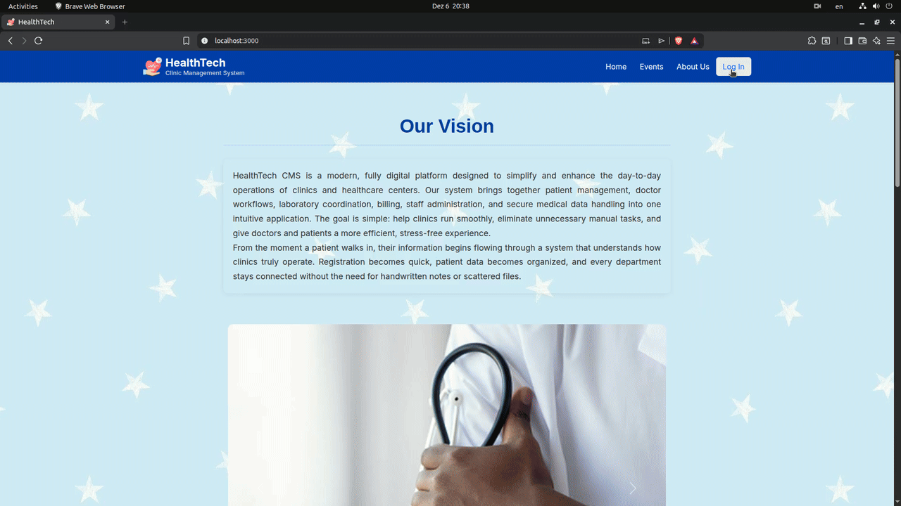
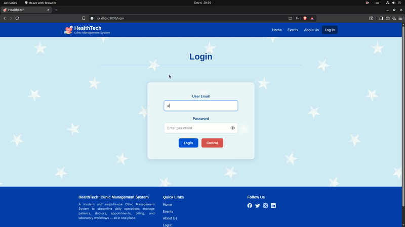
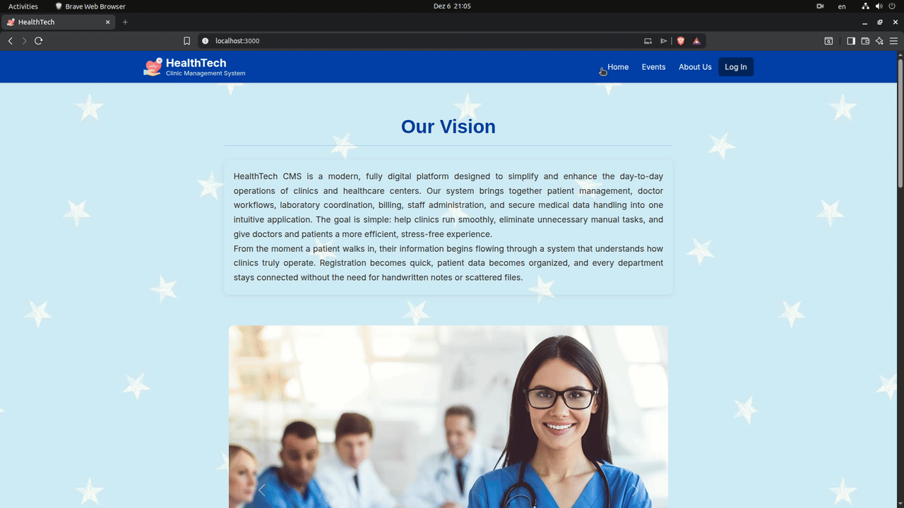

<p align="center">
  
</p>

<h1 align="center">HealthTech – Clinic Management System</h1>

<p>
  A modern, role-based clinic management platform built with <b>React</b>, offering dedicated dashboards for doctors, lab technicians, front-office staff, and administrators.
  <br/>
  Seamlessly integrates with a <b>Node.js + Express + Sequelize</b> backend for authentication, RBAC, patient records, lab workflows, and appointments.
</p>


<p align="center">
  <!-- 🎞️ Placeholder for UI Demo GIF -->
  
</p>


# 📚 Table of Contents

Jump to a section:

1. [🏥 About the Application](#-about-the-application)
2. [📐 Architecture & Backend Overview](#-architecture--backend-overview)
3. [✨ Features](#-features)
4. [🚀 Getting Started](#-getting-started-with-the-app)
5. [🧭 How to Use the App](#-how-to-use-the-app)
6. [🔮 Future Enhancements](#-future-enhancements)
7. [🔗 Related Repository (Backend)](#-related-repository-backend)
8. [📄 Author](#-author)


# 🩺 About the Application

<p align="center">
  <!-- 🎞️ Placeholder for ABOUT PAGE GIF -->
  
</p>

The **Clinic Management System** is a unified web interface designed to streamline daily operations inside a clinic.  
It replaces fragmented tools, manual paperwork, and scattered spreadsheets by providing a **structured, role-based, secure, and intuitive interface** for clinic staff.

This application is built to serve **four major roles** within a clinic:

- **Admin**
- **Doctor**
- **Front Office Staff**
- **Lab Technician**

Each role gets a personalized dashboard and tools relevant to their responsibilities, making the clinic workflow smoother, faster, and more error-free.


### 💡 Why This App Is Important for a Clinic

Modern clinics handle a **large amount of sensitive and time-critical data**, including:

- Patient medical records  
- Appointments and schedules  
- Lab tests and results  
- Staff responsibilities and role management  
- Events, notifications, and daily operations  

When these processes are handled manually or across disconnected systems, clinics face:

#### ❌ Inefficiencies in communication  
#### ❌ Risk of human error  
#### ❌ Mismanaged patient data  
#### ❌ Slow service and patient frustration  
#### ❌ Poor coordination between staff roles  

This application addresses all of those issues by providing:

#### ✔ A Centralized System  
##### ✔ Role-Based Access Control (RBAC)  
#### ✔ Real-Time Data Sync  
#### ✔ Professional, Scalable & Cloud-Ready  
#### ✔ Modern User Experience  


# 📐 Architecture & Backend Overview

The Clinic Management System follows a **three-tier architecture** consisting of:

1. A **React-based frontend** (this repository)
2. A **Node.js + Express backend API**
3. A **MySQL relational database** hosted locally, via Docker, or on local services.

This layered design ensures scalability, clean separation of concerns, and secure handling of patient and staff data.

<p align="center">
  
</p>

### 🧠 How the System Works Together

**React Frontend (UI/UX Layer)**  
The frontend handles:
- Role-based dashboards  
- Navigation and views  
- Patient lists, appointments, and lab workflows  
- Login and session flow  
- Form inputs and validations  

All dynamic data comes from the backend API.

**Node.js Backend (API & Logic Layer)**  
The backend manages:
- Authentication & authorization  
- Token handling  
- Mapping users to roles (Admin, Doctor, Lab Technician, etc.)  
- CRUD operations for patients, staff, appointments, lab tests  
- Validation and business rules  
- Secure communication with the database  
- Sequelize ORM models, migrations, and relationships  

**MySQL Database (Data Layer)**  
The database stores all clinic-related information including:
- Clinic details  
- Staff and roles  
- Patients and appointments  
- Test reports and prescriptions  
- Lab workflows  
- Billing and administrative records  


# ✨ Features

The Clinic Management System provides a rich set of features tailored to the daily operations of a clinic.  
Every feature is connected to the backend API and adapts dynamically based on the user’s role.

<p align="center">
  <!-- 🎞️ Placeholder for a GIF showcasing multiple features -->
  
</p>

### 🌟 Key Highlights

- Fully role-based dashboards (Admin, Doctor, Front Office, Lab Technician)  
- Secure authentication & controlled access  
- End-to-end patient workflow support  
- Lab test workflows connected to doctors & admin  
- Appointment scheduling and management  
- Event announcements and internal communication  
- Error handling, fallback pages, and polished UI  

The section below breaks down features **role-by-role**, showing how each part of the clinic benefits from this system.


## 👨‍💼 Admin Features

<p align="center">
  
</p>

Admins get the highest level of control. Their dashboard offers:

#### 🛠 User & Role Management
- View all registered users  
- Assign or modify roles (Doctor, Lab Technician, Front Office)  
- Manage staff credentials  
- Improve onboarding and reduce administrative overhead  

#### 📊 Clinic Oversight
- Overview of patient activity  
- Track lab operations  
- Monitor appointments & staff availability  

## 🧑‍💼 Front Office Features

<p align="center">
  
</p>

Front office staff interact with patients first. Their dashboard supports:

#### 📝 Patient Registration
- Add new patients with demographic details  
- Avoid manual entry errors and paper forms  

#### 📅 Appointment Scheduling
- Book appointments for doctors  
- Manage time slots  
- View upcoming schedules  

#### 📞 Patient Search & Info Retrieval
- Quickly find patient details  
- Supports walk-ins and returning patients  

## 👨‍⚕️ Doctor Features

<p align="center">
  
</p>

Doctors receive tools that let them focus on actual care:

#### 🧑‍⚕️ Patient Overview
- View assigned patients  
- Access medical details, visits, test results  

#### 🧪 Lab Test Integration
- See pending or completed lab reports  
- Track test statuses without manually checking with technicians  

#### 🗓 Appointment View
- See daily appointments  
- Helps doctors plan their day efficiently  

### 🧪 Lab Technician Features

<p align="center">
  
  </p>

Lab technicians get a clear, structured workflow:

#### 🔬 Test Request List
- See all tests ordered by doctors  

#### 📍 Update Lab Test Status
- Mark tests as *in progress* or *completed*  
- Upload or update test notes  

#### 📄 Generate Lab Reports
- Reports automatically link to doctors & patients  
- Ensures accurate results flow through the system  


## 📅 Events & Public Integration

The **Events** section allows admins to post important announcements that are visible to all staff members and the general public.  
This helps the clinic and the locality stay informed about holidays, celebrations, meetings, maintenance schedules, and other internal updates without relying on external communication channels.

<p align="center">
  
</p>

#### ➕ Adding a New Event (Admin Only)

Admins can quickly create new announcements directly from their dashboard.

<p align="center">
  
</p>

Typical events include clinic holidays, doctor availability changes, staff meetings, equipment maintenance, and general announcements.


## ❗ Error Handling & User Experience Enhancements

#### 🚫 Custom 404 / NoMatch Page
<p align="center">
  
</p>

If a user navigates to an unknown route, they are shown a clean fallback page instead of a blank screen.

#### 🔐 Conditional Rendering
- Missing patient data shows *“Not Available”*  
- Prevents app crashes and enhances professionalism  

#### ⚡ Responsive UI
- Works beautifully across laptops, tablets, and desktops  


# 🚀 Getting Started with the App

This repository contains **only the frontend** of the Clinic Management System.  
To use the app fully, you must connect it to the **backend API**, which handles authentication, roles, patients, appointments, lab tests, and more.

You can run the frontend in two ways:

1. **Locally with Node.js**  
2. **Using Docker (recommended)**

Because this project was originally developed with an **older Node.js version**, running it locally may require matching a compatible Node version.  
Docker automatically handles this and provides a clean, consistent environment — making it the recommended method.

## 🐳 Running the frontend with Docker (Recommended)

This is the easiest and most reliable method, especially on systems where Node.js versions differ.

### ✅ Prerequisites (Docker method)

- **Docker** installed and running:
  - Docker Desktop (Windows / macOS) or
  - Docker Engine (Linux)
- **Git** (to clone the repository)
- Backend API reachable from inside the container (e.g. on your host machine or in the same Docker network)

This is the easiest and most reliable method, especially on systems where Node.js versions differ.


### 1️⃣ Clone the Repository

```bash
git clone https://github.com/YOUR_USERNAME/Clinic_Management_Frontend
cd Clinic_Management_Frontend
```

### 2️⃣ Create the `.env` File

Inside the project root:

```env
REACT_APP_API_URL=http://localhost:4000
```

Replace this URL with your backend's deployed address.

### 3️⃣ Build and Run the Docker Container

```bash
docker compose up --build
```

Your app will now be available at Port 3000 by default or another if you altered it (check .env):

```
http://localhost:3000
```

## 💻 Running the Frontend Locally (Manual Method)

If you prefer running the app without Docker, ensure that your **Node version matches the one used during development** — older React scripts may break on newer Node versions.

### ✅ Prerequisites (Local Node.js method)

- **Node.js installed**  
  - Preferably a version close to what the project was originally developed with (e.g., **Node 14**)  
  - Newer Node versions may cause issues with older React scripts

- **npm** (comes with Node.js) or **yarn**

- **Git** (optional, for cloning the repository)

- **A running backend API** that the frontend can communicate with

> If you prefer running the app without Docker, make sure your Node version is compatible.


### 1️⃣ Install Dependencies

```bash
npm install
```

### 2️⃣ Set Backend API URL

Create a `.env` file:

```env
REACT_APP_API_URL=http://localhost:4000
```
Replace this URL with your backend's deployed address.

### 3️⃣ Start the Development Server

```bash
npm start
```

The app will launch at Port 3000 by default or another if you altered it (check .env):

```
http://localhost:3000
```

# 🧭 How to Use the App

Once the frontend is running and connected to the backend, you can log in using the **pre-seeded accounts** that come with the backend database.  
These accounts are automatically created when the backend is initialized, allowing you to explore all the different dashboards and workflows without manually setting up users.

If you want to create a new personal account later, it must be created by an **Admin user** through the backend’s user management features.

### 🔐 Default Login Accounts (Seeded Data)

| Role               | Username          | Password   | Access Level Description |
|--------------------|-------------------|------------|--------------------------|
| **Admin**          | admin@email.com     | admin@123   | Full access to all dashboards, users, clinic data, and system management |
| **Doctor**         | doctor@email.com    | doctor@123  | Can view assigned patients, test results, appointments, and doctor tools |
| **Front Office**   | front@email.com     | front@123   | Can register patients, manage appointments, and handle reception workflows |
| **Lab Technician** | lab@email.com       | lab@123     | Can view test requests, update test statuses, and manage lab workflows |

> These are demo accounts intended for testing the system.  
> You can use them to walk through every dashboard and functionality.

# 🔮 Future Enhancements

HealthTech is already fully functional, but several improvements are planned to enhance usability, scalability, and the overall user experience. These upcoming features will help make the system more intuitive, efficient, and production-ready.

### 📌 Planned Improvements

- **Adopt a Global State Management System (React Pinia, Redux, or Recoil)**  
  To streamline data flow between components, reduce prop drilling, and improve performance across dashboards.

- **Custom Alert & Notification System**  
  Replace browser alerts with a unified, polished alert/modal component for confirmations, warnings, errors, and success messages.

- **Interactive Tooltips & User Guidance**  
  Add tooltips, onboarding hints, and UI helpers to guide new users through features like appointments, patient registration, and lab workflows.

- **Patient Account Creation Module**  
  Allow admins—or eventually patients themselves—to create login accounts with controlled access and verification.

### 🚀 Additional Enhancements Under Consideration

- **Dark Mode UI Theme**  
  A modern toggleable dark/light theme to improve readability and give the app a professional touch.

- **Role-Based Landing Pages**  
  Automatically redirect roles (Admin, Doctor, Front Office, Lab Tech) to personalized start pages with quick actions.

- **Improved Form Validation & Error Messaging**  
  Replace basic HTML validation with a consistent library like React Hook Form or Formik, paired with detailed error descriptions.

- **Activity Logs / Audit Trail**  
  Track important actions such as patient edits, appointment updates, and lab report changes for compliance and debugging.

- **Search & Filter Improvements**  
  Fast, dynamic searching across patients, appointments, and reports with advanced filtering options.

- **Responsive Mobile-Friendly Layout**  
  Enhance mobile UI for staff accessing the app on tablets or small screens.

These enhancements will help HealthTech grow from a student project into a robust, real-world clinical management solution.

# 🔗 Related Repository (Backend)

The backend service that powers this frontend can be found here:

👉 **Backend Repository:**  
https://github.com/adnanmk-1999/Clinic_Management_Backend

This includes:

- Authentication and login flow  
- Role-based access logic  
- Patient database models  
- Admin, Doctor, Lab Tech, and Front Office API routes  
- MySQL integration (Local / Docker)  
- Docker Compose support  

# 👤 Author  
Developed by **Adnan**  
Software Developer & Robotics Engineer
